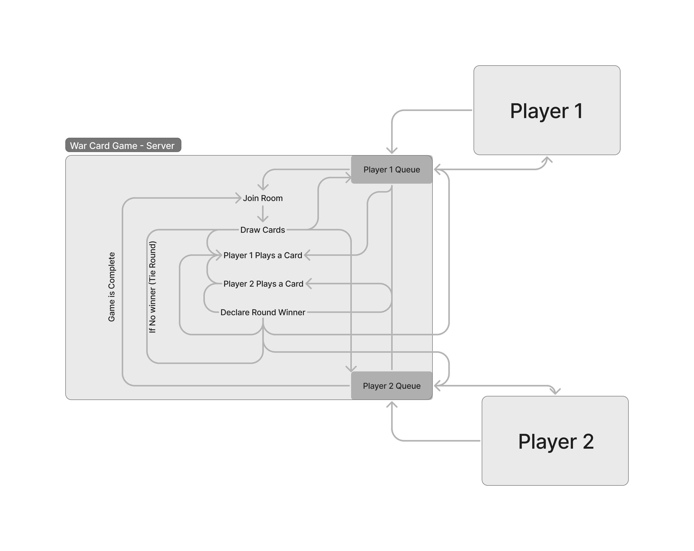

# LAB - 14

## Project: Card Game: War via Event Driven Application

### Authors: Donna Ada & Ike Steoger

### Problem Domain

### Links and Resources

- [GitHub Actions ci/cd](https://github.com/IkeSteoger/war-card-game/actions)
<!-- - [back-end dev server url]() -->
<!-- - [back-end prod server url]() -->

### Collaborators

### Setup

#### How to initialize/run your application

Clone repo, `npm i`, alter `.env.sample` into `.env` and make any needed changes, `npm start`.

#### Tests

To run tests, after running `npm i`, run the command `npm test`

#### UML

